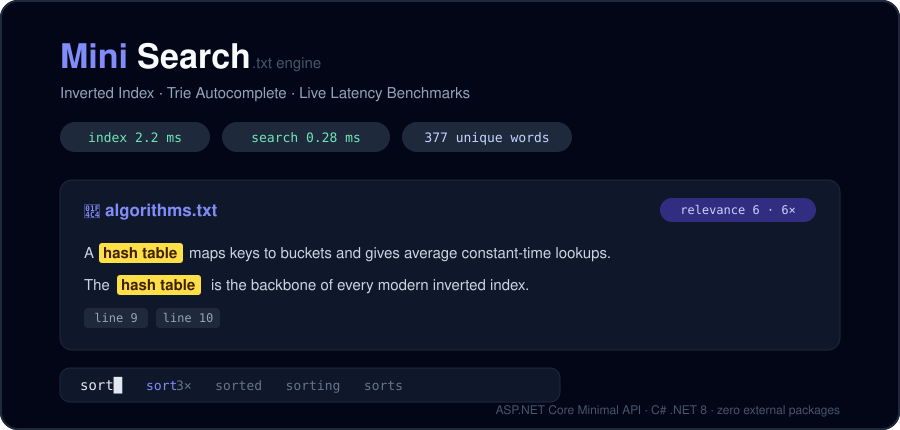

# 🔎 Mini Search Engine — C# .NET 8

[](https://github.com/Sea8611/I.T-211-Project/actions/workflows/ci.yml)




A standalone keyword search engine that indexes and searches local `.txt` files, built as a
complete Data Structures & Algorithms showcase on top of ASP.NET Core Minimal APIs.

## Features

- 🔍 **Inverted index** — hand-built hash table (`Dictionary<string, List<SearchResult>>`) whose postings carry occurrence counts and 1-based line numbers
- 🌳 **Trie autocomplete** — prefix tree implemented 100% from scratch, powering the live dropdown while you type
- ⚖️ **TF ranking** — most relevant files first, with AND intersection and OR union matching
- ⏱️ **Stopwatch benchmarks** — exact `indexTimeMs` / `searchTimeMs` returned by every call and displayed live
- ✨ **Highlighted snippets** — ~100-character previews with `<mark>` tags, extracted from the original text
- 🚀 **One-command start** — `dotnet run` opens the GUI at http://localhost:5000 automatically
- 🎨 **Two built-in themes** — a cyberpunk "Plasma Daemon" UI (default, `/`) and the classic
clean UI (`/classic.html`), switchable from a link at the top of either page
- 📴 **Offline seeding** — if the GitHub dictionary is unreachable (private repo, no internet),
the bundled `data/dictionary.json` is loaded automatically instead

## Downloads

Grab a ready-to-run build from the
[Releases page](https://github.com/Sea8611/I.T-211-Project/releases) — no .NET install needed:

| Release | UI theme you get | File |
|---------|------------------|------|
| **v1.2-CYBERPUNK** (latest) | Cyberpunk "Plasma Daemon" (default) + classic one click away | `MiniSearchEngine-v1.2-win-x64.zip` |
| **v1.1-CLASSIC** | Classic clean UI (default) + cyberpunk one click away | `MiniSearchEngine-v1.1-win-x64.zip` |
| Source code | Both themes included — swap the default via the guide below | `MiniSearchEngine-v*-source.zip` |

Each zip contains `MiniSearchEngine.exe`, the `documents/` sample corpus, and
`data/dictionary.json`. Unzip anywhere and double-click the exe — the server starts and
your browser opens http://localhost:5000 by itself.

- **Inverted Index** (hash table) — `Dictionary<string, List<SearchResult>>` mapping every
  sanitized word to its postings (documents, occurrence counts, line numbers).
- **Trie / Prefix Tree** — implemented 100% from scratch (`TrieNode` + `Trie`, no libraries)
  over the full vocabulary, powering live autocomplete.
- **TF ranking** — documents ranked by term frequency; multi-word **AND** intersection and
  **OR** union matching.
- **Stopwatch benchmarks** — exact `indexTimeMs` / `searchTimeMs` returned by every call and
  displayed live in the UI.
- **Highlighted snippets** — ~100-char previews with `<mark>` tags, extracted from the
  original (non-sanitized) text.

## Changing the GUI (theming guide)

The entire interface is **one HTML file** — there is no framework build step. Everything
you see (colors, fonts, layout, text) lives in [`wwwroot/index.html`](wwwroot/index.html)
(cyberpunk theme) and [`wwwroot/classic.html`](wwwroot/classic.html) (classic theme).

**Edit → see it live in 10 seconds, no recompile:**

1. Open `wwwroot/index.html` in any editor (VS Code, Notepad).
2. Save the file.
3. Refresh your browser tab — the server serves the file straight from disk.
4. If you are running the **exe** instead: copy your edited file into the exe folder's
   `wwwroot/` and refresh. The exe serves whatever is on disk.

**Where things live in the file:**

| What you want to change | Where |
|--------------------------|-------|
| Colors (neon red, cyan, background) | the `:root { --void: …; --red: …; }` CSS block |
| Glow strength, scanlines, borders | the `.panel`, `.glow-red`, `.scanlines` CSS rules |
| Fonts | the Google Fonts `<link>` + `tailwind.config.fontFamily` |
| Headline text / tagline | the `<h1>` and `<p>` inside `<header>` |
| Placeholder text, button labels | the `placeholder=` attributes and button elements |
| Result card layout | the `renderResults()` JavaScript template literals |

**Make your own theme the default:** rename the current `index.html` → `cyberpunk.html`,
yours → `index.html`, and swap the link targets in the top-bar switcher of each file.
Nothing else changes — both themes are always reachable from either page.

**After editing, ship it:** rebuild the exe with the commands in the Releases section, or
just zip the exe folder with your updated `wwwroot/` — the GUI is read from disk at runtime.

## Quick start

```bash
dotnet run
```

Kestrel binds to **http://localhost:5000** and the app **auto-opens your default browser**
(`Process.Start`) as soon as the server answers its own `/health` probe. On first page load
the GUI indexes the bundled `./documents` folder automatically.

Put your own `.txt` files in `documents/` (or type any absolute folder path in the GUI and
press **Index folder**).

> Requires the .NET 8 SDK. The project also sets `RollForward: LatestMajor`, so newer SDKs
> (9/10+) can run it unchanged.

## API

| Method | Route | Description |
|--------|-------|-------------|
| `POST` | `/api/index?folder={path}` | Crawl the folder, sanitize text, build the inverted index + Trie. Default folder: `./documents`. |
| `GET`  | `/api/search?q={query}&mode=and\|or` | TF-ranked matches, line numbers, highlighted snippets, `searchTimeMs`. `mode=or` forces union matching; otherwise a standalone `or` token in the query switches modes automatically. |
| `GET`  | `/api/autocomplete?prefix={p}` | Top 10 Trie completions with corpus frequencies + `queryTimeMs`. |
| `GET`  | `/api/definition?word={term}` | Phase 2: dictionary definition of one word, seeded from MariaDB or GitHub JSON. `null` when unknown. |
| `GET`  | `/api/stats` | Files indexed, unique words, total tokens, index build time — plus seed state (`seededTerms`, `seedProvider`). |
| `GET`  | `/health` | Liveness probe used by the auto-launcher. |

### Example

```bash
curl -X POST http://localhost:5000/api/index
curl "http://localhost:5000/api/search?q=hash+table"
curl "http://localhost:5000/api/search?q=graph+or+tree"        # explicit OR operator
curl "http://localhost:5000/api/search?q=graph+tree&mode=or"   # forced OR
curl "http://localhost:5000/api/autocomplete?prefix=sort"
curl "http://localhost:5000/api/definition?word=trie"   # Phase 2 dictionary lookup
curl http://localhost:5000/api/stats
```

```json
{
  "query": "hash table",
  "mode": "AND",
  "totalMatches": 3,
  "searchTimeMs": 0.28,
  "results": [
    {
      "documentName": "algorithms.txt",
      "relevanceScore": 6,
      "occurrenceCount": 6,
      "lineNumbers": [9, 10, 24],
      "snippets": ["A <mark>hash</mark> <mark>table</mark> maps keys to buckets…"]
    }
  ]
}
```

## Phase 2 — external data seeding (MariaDB / GitHub JSON)

On startup the engine loads **word → definition** pairs from a configurable source and
seeds them into the Trie and a definition store — **without touching the search
algorithms**. Seeded words become searchable and autocompletable even when they appear
in no `.txt` file, and survive re-indexing (they are re-applied after every rebuild).

The provider is chosen in `appsettings.json`:

```json
"SeedDataSource": {
  "Provider": "GitHub",                                   // or "MariaDB"
  "GitHub":   { "RawUrl": "https://raw.githubusercontent.com/<user>/<repo>/main/data/dictionary.json" },
  "MariaDB":  { "ConnectionString": "Server=localhost;Port=3306;Database=search_engine;User ID=root;Password=…;" }
}
```

Both providers implement `IDataSource.LoadTermsAsync()` (never throws — an unreachable
source simply leaves the engine unseeded and the error visible in `/api/stats`).

### Option A — GitHub raw JSON (zero setup, default)

Point `RawUrl` at any public JSON file shaped like `data/dictionary.json`:

```json
{
  "terms": [
    { "term": "trie", "definition": "A prefix tree: each edge consumes one character…" }
  ]
}
```

(A bare top-level array of `{ term, definition }` objects works too.) The bundled file
ships in this repo, so the feature works out of the box.

### Option B — MariaDB / MySQL

Switch `Provider` to `"MariaDB"` and fill in the connection string. The provider
(`MySqlConnector`) creates its table automatically on first connect:

```sql
CREATE DATABASE IF NOT EXISTS search_engine;
USE search_engine;
-- created automatically, but you can run it yourself:
CREATE TABLE IF NOT EXISTS terms (
    term       VARCHAR(100) NOT NULL PRIMARY KEY,
    definition TEXT         NOT NULL
) ENGINE=InnoDB DEFAULT CHARSET=utf8mb4;

INSERT INTO terms (term, definition) VALUES
('algorithm', 'A finite, unambiguous sequence of steps…'),
('trie',      'A prefix tree where every edge consumes one character…');
```

Each row's `term` is sanitized the same way as query text (lowercased, punctuation
stripped), so `"Inverted Index"` and `"inverted index"` are one entry.

## Text sanitization pipeline

1. **Tokenize** — a Unicode regex (`[\p{L}\p{N}]+`) splits on every non-letter/digit, which
   strips all punctuation in one pass.
2. **Lowercase** — `ToLowerInvariant()` on both documents and queries.
3. **Stop-words** — `a, an, the, is, of, to, in, on, at, for` are ignored by the index.

The same pipeline runs for indexing *and* searching, so both live in one normalized
vocabulary space.

## Data structures & algorithms (teaching notes)

| Structure | File | Complexity |
|-----------|------|------------|
| Inverted index (hash table of postings) | `SearchEngine.cs` | O(1) average lookup per term |
| Trie with explicit `TrieNode` pointers  | `Trie.cs`, `TrieNode.cs` | O(L) insert/lookup; prefix DFS collects the sub-trie |
| AND matching                            | `SearchEngine.MultiTermLookup` | intersection seeded from the rarest postings list |
| OR matching                             | `SearchEngine.UnionLookup` | union merge keeping the max per-document frequency |
| TF ranking                              | `SearchEngine.RankAndBuildResults` | sort by occurrence count (descending) |
| Snippet extractor                       | `SearchEngine.BuildSnippets` | ~100-char window around the first whole-word hit, HTML-escaped, `<mark>`-wrapped |

Postings (`SearchResult` in `Models.cs`) carry the **document name, file path, occurrence
count, and 1-based line numbers**. The AND merge unions the line numbers of every matched
term and sums their frequencies into the relevance score.

Threading: the index is rebuilt atomically (build fully, then swap under one lock), so
HTTP readers never observe a half-built index.

## Project layout

```
MiniSearchEngine.csproj     net8.0 web project (RollForward: LatestMajor)
Program.cs                  Minimal API host, endpoints, auto-browser launch
SearchEngine.cs             inverted index, crawler, ranking, snippets, benchmarks
Trie.cs / TrieNode.cs       from-scratch prefix tree
Tokenizer.cs                punctuation stripping, lowercasing, stop-words
Models.cs                   SearchResult posting + all API DTOs
wwwroot/index.html          Tailwind single-page GUI — cyberpunk theme (default, "/")
wwwroot/classic.html        Tailwind single-page GUI — classic theme ("/classic.html")
data/dictionary.json        bundled seed dictionary (offline fallback for the GitHub provider)
documents/                  sample corpus (4 files)
```

## Publishing to GitHub

The `gh` CLI may not be installed; either path below works.

**Option A — GitHub Desktop / web (no CLI):**
1. Initialize and commit locally (if not already done):
   ```bash
   git init
   git add .
   git commit -m "Mini Search Engine: inverted index + trie autocomplete (.NET 8)"
   ```
2. Create an empty repo on https://github.com/new (no README/gitignore — this project has them).
3. Push:
   ```bash
   git branch -M main
   git remote add origin https://github.com/<you>/mini-search-engine.git
   git push -u origin main
   ```

**Option B — GitHub CLI:**
```bash
winget install GitHub.cli          # once
gh auth login
gh repo create mini-search-engine --public --source=. --push
```

---

Built as an academic DSA showcase: every core structure is hand-implemented and commented
for classroom walkthroughs.
